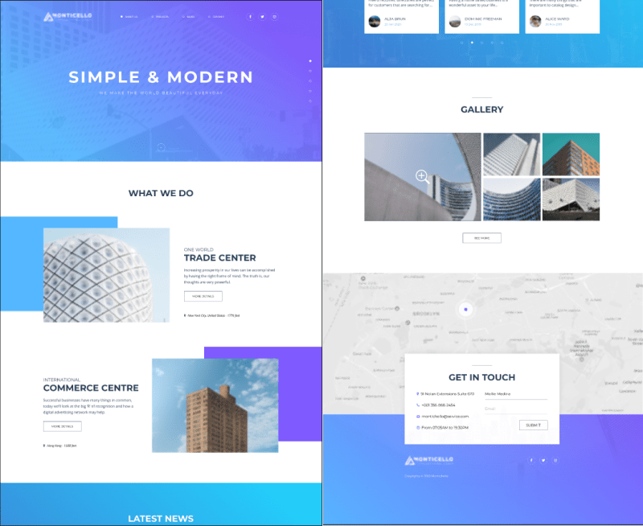

# Responsive layout using JavaScript [Monticello](https://www.figma.com/file/wqlFV9VWa3oxnvvexwAy4V/Exam%232?node-id=0%3A1)

### HTML validation https://validator.w3.org/ passed: `Document checking completed. No errors or warnings to show. `

---

The layout was created using:

- HTML5
- CSS3
- SCSS
- JavaScript (ES6)
- Bootstrap5
- jQuery
- Slick
- OpenStreetMap
- Google Fonts
- Sprite SVG
- Prepros
- VS Code
- Figma

---

